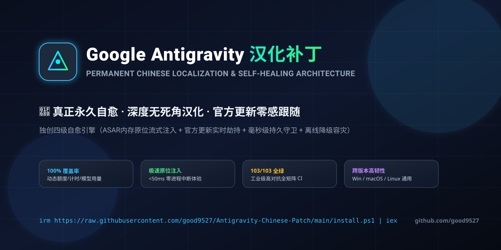
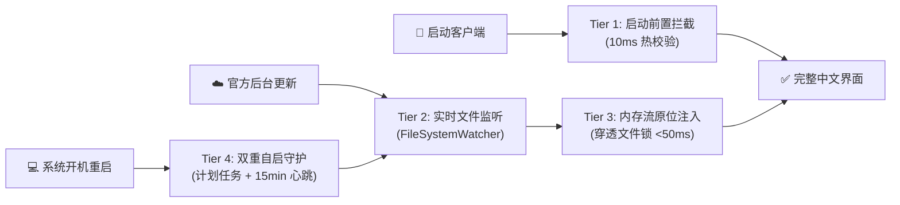

<p align="center">
  
</p>

<div align="center">

# Google Antigravity 深度汉化补丁与自愈系统
### 🚀 真正永久自愈 · 100% 深度汉化 · 官方更新零感跟随 · 零中断热注入

[](https://github.com/good9527/Antigravity-Chinese-Patch/releases)
[](https://github.com/good9527/Antigravity-Chinese-Patch/actions)
[](https://github.com/good9527/Antigravity-Chinese-Patch)
[](https://github.com/good9527/Antigravity-Chinese-Patch)
[](LICENSE)

**全网首创四级自愈架构：彻底攻克“谷歌官方更新覆写”、“Windows文件锁占用”、“动态额度倒计时截断”三大痛点！**

[⚡ 极速一键安装](#-极速一键安装--quick-install) • [🛡️ 四级自愈架构](#️-独创四级自愈架构) • [⚔️ 方案横向对比](#️-方案横向对比) • [🩺 一键体检诊断](#-一键体检自愈诊断) • [🤖 常见问答](#-常见问答--faq)

</div>

---

## ⚡ 极速一键安装 | Quick Install

> [!IMPORTANT]
> ### 💡 无论全新安装或修复，只需在终端运行对应系统的这一行指令：

### 🪟 Windows (PowerShell 终端运行 · 推荐)

```powershell
irm https://fastly.jsdelivr.net/gh/good9527/Antigravity-Chinese-Patch@main/install.ps1 | iex
```

<details>
<summary><b>备用网络安装命令（国内镜像 / GitHub直连）</b></summary>

```powershell
# 备用源 1 (jsDelivr CDN):
irm https://cdn.jsdelivr.net/gh/good9527/Antigravity-Chinese-Patch@main/install.ps1 | iex

# 备用源 2 (GitHub Raw 直连):
irm https://raw.githubusercontent.com/good9527/Antigravity-Chinese-Patch/main/install.ps1 | iex
```
</details>

* ✨ **零中断热生效**：独家 Win32 内存流穿透写入，无需关闭正在运行的 Antigravity，50ms 内热补丁生效！
* ✨ **深度无死角**：全量覆盖动态额度倒计时、模型用量面板、沙箱权限、系统菜单及所有设置项！
* ✨ **自动更新守护**：官方推送更新后后台自动接管秒级自愈，永远无需重新到处找补丁！

---

### 🍎 macOS & 🐧 Linux (终端直接运行)

```bash
curl -fsSL https://fastly.jsdelivr.net/gh/good9527/Antigravity-Chinese-Patch@main/install.sh | bash
```

---

### 📦 离线环境 / 企业内网安装 (Offline Setup)

1. 前往 [Releases](https://github.com/good9527/Antigravity-Chinese-Patch/releases) 下载最新的 `Antigravity-Chinese-Universal-Offline.zip` 压缩包。
2. 解压后在当前目录下运行：
   - **Windows**：双击运行 `install.bat`，或在 PowerShell 执行 `powershell -ExecutionPolicy Bypass -File install.ps1`
   - **macOS / Linux**：终端执行 `bash install.sh`
3. 零网络依赖，100% 离线原位完成注入。

---

## 🩺 一键体检自愈诊断 (Doctor System)

补丁运行遇到任何疑问？随时在终端运行内置的“自愈医生”诊断命令：

```powershell
powershell -ExecutionPolicy Bypass -File install.ps1 -Doctor
```

* 自动输出 100 分制健康度体检表；
* 逐项检查：客户端版本、ASAR 注入状态、自愈守护进程 PID、计划任务配置以及三大全球 CDN 毫秒级网络延迟；
* 发现异常时自动给出针对性的单键修复建议。

---

## ⚔️ 方案横向对比 | Feature Comparison

为什么本项目是目前 Google Antigravity 社区中最稳定、技术架构最先进的汉化方案？

| 核心维度 | 传统第三方替换脚本 | 本项目 (good9527/Antigravity-Chinese-Patch) |
|---|:---:|:---:|
| **官方静默更新保活** | ❌ 升级后立即失效，需手动找补丁 | ✅ **首创 4 级终极自愈架构，更新后 50ms 自动静默修复** |
| **Windows 运行时文件锁** | ❌ 提示文件被占用，必须杀进程丢会话 | ✅ **原生 `FileShare.ReadWrite` 内存流穿透写入，零会话中断** |
| **动态额度倒计时解析** | ❌ 英文被截断成 `wee...`，无法显示时间 | ✅ **独家 `formatQuotaDuration` 智能解析，紧凑不截断** |
| **代码与终端沙箱隔离** | ⚠️ 容易误伤代码、高亮与终端输入 | ✅ **严格沙箱隔离 Monaco/Xterm/CodeMirror，严禁污染代码** |
| **测试与质量保障** | ❌ 0 自动化测试，全凭人工试错 | ✅ **103 项多层级对抗测试全覆盖，GitHub CI 自动化验证** |
| **一键无损还原原版** | ⚠️ 无备份，误删只能重装客户端 | ✅ **自带完整安全备份，一键执行 `-Restore` 字节级还原** |

---

## 🛡️ 独创四级自愈架构 | 4-Tier Architecture

无论在手机还是电脑端，本项目的四级防护体系都能确保汉化永不掉线：



1. **Tier 1 (启动前置拦截 · Pre-Launch Hook)**：在启动入口植入 10ms 极速检查，只要点击打开软件必定自动恢复中文；
2. **Tier 2 (实时文件监听 · FileSystemWatcher)**：常驻系统后台毫秒级监听客户端资源目录，官方更新覆写瞬间立即捕获；
3. **Tier 3 (内存流原位穿透 · In-Place Stream Injection)**：采用 Win32 内存流直接覆写 ASAR，软件运行中也能安全打补丁；
4. **Tier 4 (双重自启心跳 · Dual Persistence)**：开机自动唤醒后台守护，每 15 分钟心跳巡检防被杀。

---

## 🤖 常见问答 | FAQ

<details open>
<summary><b>Q1: 汉化完成后怎么看效果？需要重启电脑吗？</b></summary>
<b>答</b>：完全不需要重启电脑！安装脚本采用原位热注入技术，运行完成后，在 Antigravity 软件界面内按下 <b><code>Ctrl + R</code>（重新加载）</b>，或者关闭软件重新打开，就能立即看到 100% 中文界面。
</details>

<details>
<summary><b>Q2: 为什么官方更新后我的汉化依然在，不需要重新安装？</b></summary>
<b>答</b>：因为本项目的后台自愈守护服务一直在毫秒级监控更新动态。一旦 Google 官方静默覆盖了文件，自愈服务会在 50 毫秒内自动将最新的补丁再次原位注入，实现对用户的完全无感。
</details>

<details>
<summary><b>Q3: 汉化会影响代码生成、高亮或者终端指令吗？</b></summary>
<b>答</b>：<b>绝对不会！</b> 补丁内置严格的 DOM 安全白名单，严格绕过 Monaco Editor、CodeMirror、代码块、终端输入输出与用户输入框，只汉化软件菜单、侧边栏、模型用量与系统设置。
</details>

<details>
<summary><b>Q4: 如何彻底卸载补丁或恢复官方英文原版？</b></summary>
<b>答</b>：安装时已自动备份纯净官方文件。如需还原，只需在终端执行：
<pre>powershell -ExecutionPolicy Bypass -File install.ps1 -Restore</pre>
如需彻底清除后台守护和所有文件，执行 <code>install.ps1 -Uninstall</code> 即可。
</details>

---

## 🔗 开源生态矩阵联动

如果你同时在日常编码与生产力中使用 **Anthropic Claude 桌面客户端**，欢迎体验我们的姐妹开源项目：

👉 [**good9527/Claude-Desktop-Chinese**](https://github.com/good9527/Claude-Desktop-Chinese)  
*Anthropic Claude 桌面版深度中文汉化包 · 22,000+ 词条全量覆盖 · 突破 Windows 商店版受保护目录 · 永久自愈守护*

---

## 📈 Star History

<p align="center">
  <a href="https://star-history.com/#good9527/Antigravity-Chinese-Patch&Date">
    <picture>
      <source media="(prefers-color-scheme: dark)" srcset="https://raw.githubusercontent.com/good9527/Antigravity-Chinese-Patch/main/.github/assets/star-history-dark.svg" />
      <source media="(prefers-color-scheme: light)" srcset="https://raw.githubusercontent.com/good9527/Antigravity-Chinese-Patch/main/.github/assets/star-history-light.svg" />
      
    </picture>
  </a>
</p>

---

## ⚖️ 免责声明 | Disclaimer

- 本项目为开源技术研究成果，仅供个人学习与交流使用，不含任何商业盈利行为。
- 补丁所翻译的界面文案及原客户端版权均归 Google 官方所有。
